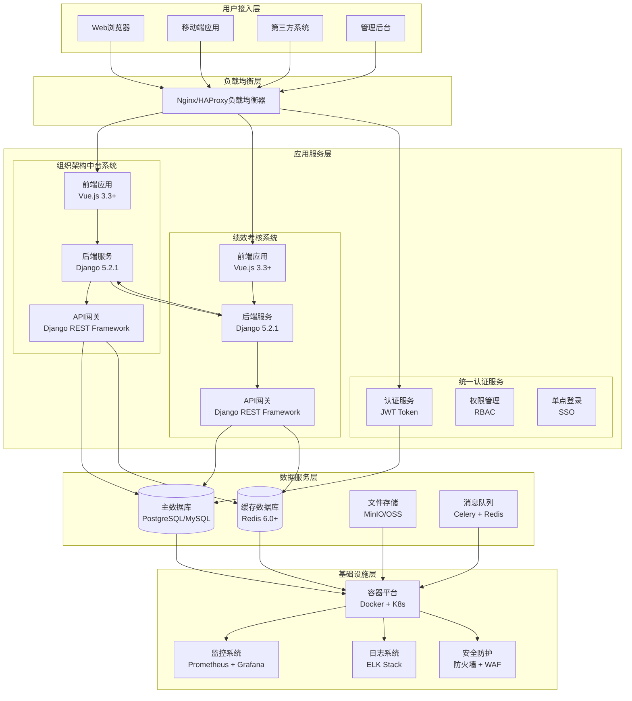
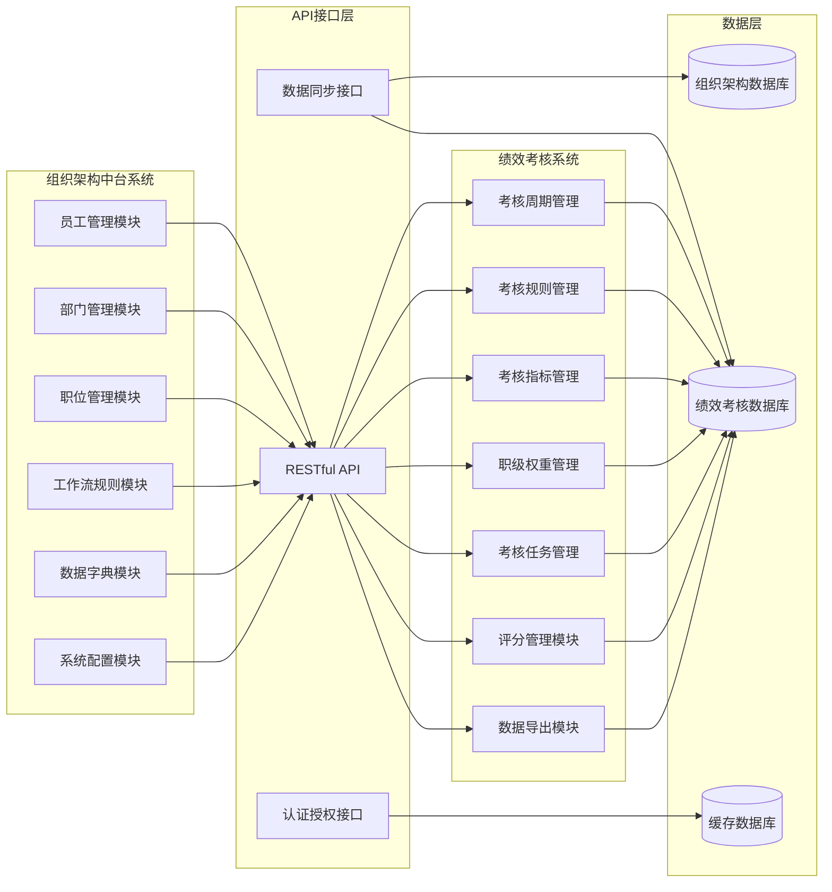
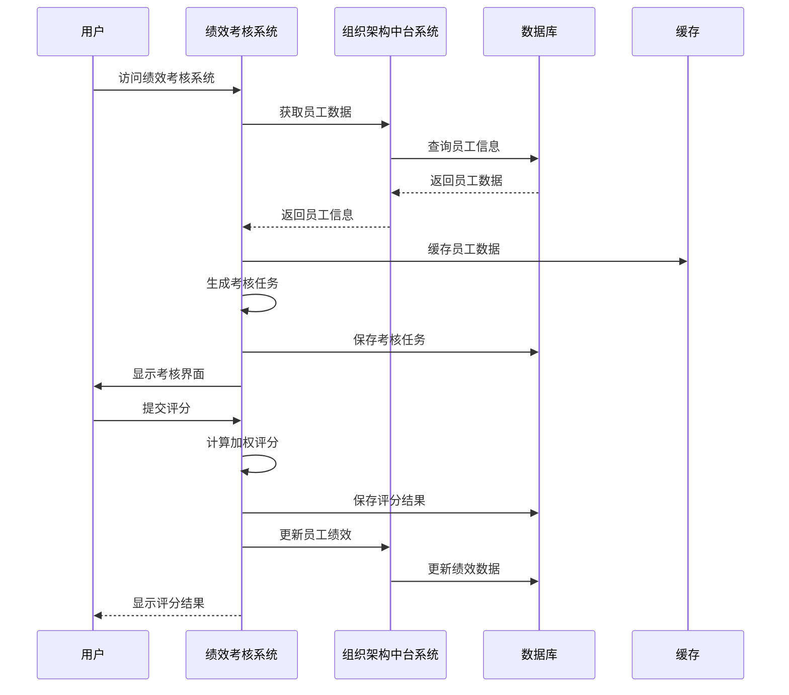
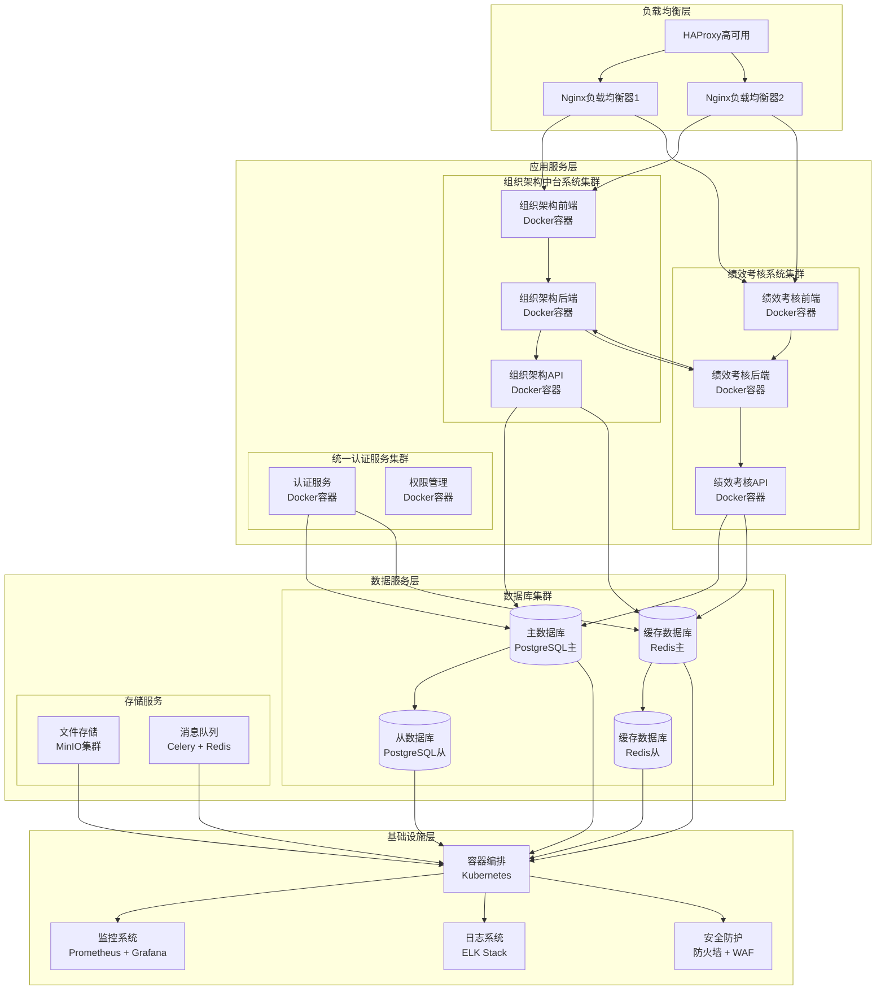
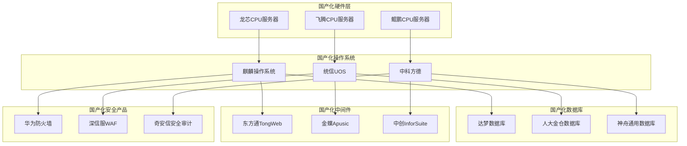
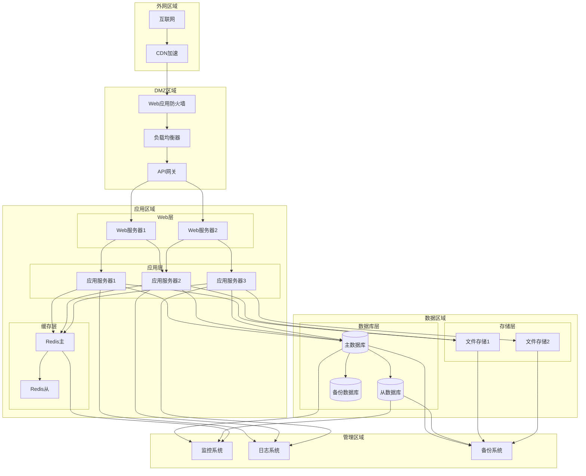

# 中煤内蒙古能源有限公司绩效考核系统建设项目报价文件

## （一）项目理解与需求分析

### 1、项目背景与意义
**数字化转型需求**：
中煤内蒙古能源有限公司作为大型能源企业，在数字化转型过程中需要建立统一的数据中台体系。组织架构中台系统作为企业数字化转型的基础平台，承担着统一组织架构管理、人员信息管理、岗位管理等核心职能，为其他业务系统提供标准化的组织数据服务，是企业数字化基础设施的重要组成部分。

**绩效考核管理需求**：
随着企业规模的不断扩大和人力资源管理需求的日益复杂，传统的绩效考核方式已无法满足现代企业的管理需求。绩效考核系统为企业提供科学的绩效考核解决方案，通过数字化手段提升人力资源管理效率和决策支持能力，实现绩效考核的标准化、规范化和智能化。

**系统集成需求**：
两个系统采用松耦合的架构设计，绩效考核系统通过标准化的API接口获取组织架构中台系统的数据，实现数据的实时同步和共享，避免数据孤岛，提升数据一致性和系统集成度。

### 2、业务需求分析
**组织架构管理需求**：
- 支持多层级部门结构管理，满足大型企业的复杂组织架构需求
- 提供完整的职位体系管理，支持13级职位级别体系
- 实现员工全生命周期管理，从入职到离职的完整流程管理
- 支持工作流规则配置，实现组织架构变更的流程化管理
- 提供数据字典管理，确保数据的标准化和规范化

**绩效考核管理需求**：
- 支持多种考核规则配置，包括本部门上级评下级、全公司上级评下级、同级互评、下级评上级等
- 实现职级权重管理，支持基于职位级别的差异化权重配置
- 提供考核任务自动生成功能，根据考核规则自动匹配评价关系
- 支持在线评分管理，提供直观的评分界面和权重计算
- 实现考核结果统计分析，提供多维度的数据分析和报表导出

**系统集成需求**：
- 绩效考核系统通过RESTful API接口获取组织架构中台系统的员工、部门、职位等基础数据
- 支持数据的实时同步，确保两个系统间数据的一致性
- 提供标准化的数据接口，支持与其他业务系统的集成
- 实现单点登录（SSO），提供统一的用户认证和权限管理

### 3、技术需求分析
**架构设计需求**：
- 采用微服务架构，支持系统的独立部署和扩展
- 使用容器化技术，支持系统的快速部署和运维
- 实现前后端分离，提供良好的用户体验和系统性能
- 支持国产化环境，满足自主可控的要求

**性能需求**：
- 支持1000个用户同时在线，满足大型企业的并发访问需求
- 支持100万条员工数据的管理，满足大规模企业的数据管理需求
- 提供秒级响应时间，确保良好的用户体验
- 支持99.9%的系统可用性，确保业务连续性

**安全需求**：
- 实现基于角色的权限控制（RBAC），确保数据安全
- 支持数据加密存储和传输，保护敏感信息
- 提供完整的审计日志，满足合规性要求
- 实现国产化安全产品集成，满足自主可控要求

### 4、项目价值与目标
**业务价值**：
- 提升组织管理效率，实现组织架构的数字化管理
- 优化绩效考核流程，提高绩效考核的科学性和公正性
- 加强数据治理，建立统一的数据标准和规范
- 支持管理决策，提供数据驱动的管理支持

**技术价值**：
- 建立企业级数据中台，为数字化转型提供基础支撑
- 实现系统间的数据共享，避免数据孤岛
- 提供标准化的API接口，支持业务系统的快速集成
- 支持国产化环境，满足自主可控要求

**管理价值**：
- 实现组织架构的标准化管理，提升管理效率
- 建立科学的绩效考核体系，提升人力资源管理水平
- 提供数据分析和决策支持，提升管理决策的科学性
- 支持业务流程优化，提升整体运营效率

## （二）整体技术架构

### 1、系统架构设计
**整体架构图**：


**系统集成架构图**：


**数据流向架构图**：


**架构特点**：
- **分层架构**：采用分层架构设计，实现关注点分离
- **微服务架构**：支持系统的独立部署和扩展
- **容器化部署**：使用Docker容器化技术，支持快速部署
- **国产化适配**：支持国产操作系统、数据库、中间件等

### 2、技术架构详细设计
**前端技术架构**：
- **框架选择**：Vue.js 3.3+ + TypeScript 4.9+
- **UI组件库**：Element Plus，提供丰富的组件支持
- **状态管理**：Pinia，实现状态的高效管理
- **路由管理**：Vue Router 4+，支持单页应用路由
- **构建工具**：Vite 4+，提供快速的开发体验
- **响应式设计**：支持PC、平板、手机等设备

**后端技术架构**：
- **Web框架**：Django 5.2.1，提供强大的Web开发能力
- **API框架**：Django REST Framework 3.14+，提供RESTful API
- **数据库ORM**：Django ORM，提供高效的数据库操作
- **认证授权**：Django内置用户系统 + JWT，支持安全的用户认证
- **缓存系统**：Redis 6.0+，提供高性能的缓存服务
- **任务队列**：Celery 5.0+，支持异步任务处理

**数据库架构**：
- **主数据库**：PostgreSQL 13+ / MySQL 8.0+ / 国产数据库
- **缓存数据库**：Redis 6.0+，提供高性能缓存
- **数据备份**：支持自动备份和恢复
- **数据同步**：支持主从复制和读写分离

### 3、系统集成架构
**API集成设计**：
```
绩效考核系统 ←→ 组织架构中台系统
     │              │
     ├─ 员工数据 ────┤
     ├─ 部门数据 ────┤
     ├─ 职位数据 ────┤
     └─ 组织关系 ────┘
```

**数据流向**：
- **组织架构中台系统**：作为数据提供方，提供员工、部门、职位等基础数据
- **绩效考核系统**：作为数据消费方，通过API接口获取基础数据
- **数据同步**：支持实时同步和定时同步两种模式
- **数据一致性**：通过事务机制确保数据的一致性

**接口设计**：
- **RESTful API**：采用标准的RESTful API设计
- **数据格式**：使用JSON格式进行数据交换
- **认证机制**：支持JWT Token认证
- **接口文档**：提供完整的API接口文档

**具体API接口设计**：
```
组织架构中台系统API接口：
├─ /api/employees/          # 员工管理接口
│  ├─ GET /api/employees/  # 获取员工列表
│  ├─ GET /api/employees/{id}/  # 获取员工详情
│  └─ POST /api/employees/  # 创建员工
├─ /api/departments/        # 部门管理接口
│  ├─ GET /api/departments/  # 获取部门列表
│  ├─ GET /api/departments/{id}/  # 获取部门详情
│  └─ GET /api/departments/tree/  # 获取部门树
├─ /api/positions/          # 职位管理接口
│  ├─ GET /api/positions/  # 获取职位列表
│  └─ GET /api/positions/{id}/  # 获取职位详情
└─ /api/organization/       # 组织架构接口
   ├─ GET /api/organization/structure/  # 获取组织架构
   └─ GET /api/organization/stats/  # 获取组织统计

绩效考核系统API接口：
├─ /api/evaluation-cycles/  # 考核周期管理
├─ /api/evaluation-rules/   # 考核规则管理
├─ /api/evaluation-tasks/  # 考核任务管理
├─ /api/evaluation-scores/ # 评分管理
└─ /api/reports/           # 报表管理
```

**数据同步机制**：
- **实时同步**：通过WebSocket实现数据的实时同步
- **定时同步**：通过定时任务实现数据的批量同步
- **增量同步**：只同步变更的数据，提高同步效率
- **冲突解决**：支持数据冲突的自动解决机制

**数据一致性保证**：
- **事务机制**：使用数据库事务确保数据的一致性
- **版本控制**：通过数据版本号控制数据的一致性
- **回滚机制**：支持数据变更的回滚操作
- **监控告警**：实时监控数据一致性，异常时及时告警

**系统间数据交互流程**：
```
1. 绩效考核系统启动时，从组织架构中台系统获取基础数据
   ├─ 获取员工列表和详细信息
   ├─ 获取部门结构和层级关系
   ├─ 获取职位信息和级别体系
   └─ 获取组织架构的完整关系

2. 绩效考核系统运行过程中，实时同步组织架构变更
   ├─ 员工信息变更（新增、修改、删除）
   ├─ 部门结构调整（新增、修改、删除）
   ├─ 职位信息变更（新增、修改、删除）
   └─ 组织关系变更（上下级关系、部门归属等）

3. 绩效考核系统生成考核任务时，基于组织架构数据
   ├─ 根据员工职位级别确定评价权重
   ├─ 根据部门关系确定评价范围
   ├─ 根据组织层级确定评价关系
   └─ 根据职位体系确定评价规则

4. 绩效考核系统完成评分后，更新组织架构相关数据
   ├─ 更新员工绩效记录
   ├─ 更新部门绩效统计
   ├─ 更新职位绩效分析
   └─ 更新组织绩效报告
```

**数据安全与权限控制**：
- **数据访问控制**：基于角色的数据访问权限控制
- **数据脱敏处理**：敏感数据的脱敏显示和处理
- **数据加密传输**：API接口数据的加密传输
- **数据审计日志**：完整的数据访问和变更审计日志

### 4、部署架构设计
**部署架构图**：


**国产化部署架构图**：


**容器化部署**：
- **容器技术**：Docker 20.10+，支持容器化部署
- **编排工具**：Docker Compose / Kubernetes，支持容器编排
- **镜像管理**：支持镜像的版本管理和自动构建
- **容器监控**：支持容器的运行状态监控

**高可用部署**：
- **负载均衡**：Nginx / HAProxy，支持负载均衡
- **数据库集群**：支持数据库的主从复制
- **缓存集群**：支持Redis集群部署
- **监控告警**：支持系统监控和告警

**网络架构图**：


**国产化部署**：
- **操作系统**：支持麒麟、统信UOS等国产操作系统
- **数据库**：支持达梦、人大金仓等国产数据库
- **中间件**：支持东方通、金蝶等国产中间件
- **硬件平台**：支持龙芯、飞腾等国产CPU

### 5、安全架构设计
**身份认证**：
- **多因子认证**：支持用户名密码、短信验证码、邮箱验证码等
- **单点登录**：支持SSO单点登录集成
- **会话管理**：支持会话超时和强制下线

**权限控制**：
- **角色权限**：基于角色的权限控制（RBAC）
- **数据权限**：支持基于部门、职位的数据权限控制
- **功能权限**：支持基于功能模块的权限控制
- **API权限**：支持基于API接口的权限控制

**数据安全**：
- **数据加密**：敏感数据加密存储
- **传输加密**：HTTPS加密传输
- **数据脱敏**：支持敏感数据脱敏显示
- **数据备份**：支持数据备份和恢复

### 6、性能架构设计
**缓存策略**：
- **多级缓存**：支持应用缓存、数据库缓存、CDN缓存
- **缓存更新**：支持缓存的自动更新和失效
- **缓存监控**：支持缓存命中率的监控和优化

**数据库优化**：
- **索引优化**：支持数据库索引的自动优化
- **查询优化**：支持复杂查询的性能优化
- **连接池**：支持数据库连接池管理

**负载均衡**：
- **水平扩展**：支持系统的水平扩展
- **负载分发**：支持智能负载分发
- **故障转移**：支持故障自动转移

### 7、技术选型理由
**前端技术选型**：
- **Vue.js 3.3+**：选择Vue.js作为前端框架，具有学习成本低、生态丰富、性能优秀的特点
- **TypeScript 4.9+**：使用TypeScript提供类型安全，减少运行时错误，提高代码质量
- **Element Plus**：选择Element Plus作为UI组件库，提供丰富的企业级组件，满足复杂业务需求
- **Vite 4+**：使用Vite作为构建工具，提供快速的开发体验和高效的构建性能

**后端技术选型**：
- **Django 5.2.1**：选择Django作为后端框架，具有强大的ORM、完善的管理后台、丰富的生态
- **Django REST Framework**：使用DRF提供RESTful API，支持序列化、认证、权限等完整功能
- **PostgreSQL/MySQL**：选择关系型数据库，支持ACID事务、复杂查询、数据一致性
- **Redis 6.0+**：使用Redis作为缓存数据库，提供高性能的缓存服务

**架构设计理由**：
- **微服务架构**：支持系统的独立部署和扩展，提高系统的可维护性和可扩展性
- **容器化部署**：使用Docker容器化技术，支持快速部署、环境一致性、资源隔离
- **前后端分离**：前后端独立开发，提高开发效率，支持团队协作
- **API优先设计**：优先设计API接口，支持多端接入，提高系统的灵活性

**国产化适配理由**：
- **自主可控**：支持国产操作系统、数据库、中间件，满足自主可控要求
- **技术兼容**：确保在国产化环境下的技术兼容性和性能表现
- **安全合规**：满足国产化安全要求，支持国产安全产品集成
- **长期支持**：提供国产化环境下的长期技术支持和维护服务

## （三）组织架构中台系统核心功能要求

### 1、组织架构管理模块

#### 1.1 部门管理功能
我公司提供的组织架构中台系统完全满足询价文件要求，具备以下核心功能：

**部门信息管理**：
- 支持部门名称、编码、描述、负责人、联系方式、地址等完整信息管理
- 实现部门编码和名称的唯一性验证，支持编码格式自定义（如：DEPT001、DEPT002等）
- 支持部门负责人的指定和变更，自动维护负责人与部门的关联关系
- 提供部门联系方式的多种格式支持（电话、邮箱、地址等）
- 支持部门描述信息的富文本编辑，包含部门职责、业务范围等详细信息
- 实现部门信息的版本管理，支持部门信息的变更历史追踪

**层级关系管理**：
- 采用优化的树形结构设计，支持无限层级的部门结构管理
- 自动维护层级关系，支持至少10级部门层级，单个部门下最多支持1000个子部门
- 实现部门层级的自动计算和排序，支持部门层级的动态调整
- 提供部门路径的完整显示，如"公司总部 > 技术部 > 开发组 > 前端组"
- 支持部门层级的批量调整和重新排序功能
- 实现部门层级的权限控制，不同层级可设置不同的访问权限

**部门状态管理**：
- 提供部门的启用/禁用状态控制，支持部门状态的批量操作
- 支持部门排序管理，可自定义部门在组织架构中的显示顺序
- 显示部门的完整层级路径，支持部门路径的快速导航
- 支持部门的批量导入、导出、删除等操作，提供Excel模板下载
- 实现部门状态的实时同步，确保多用户环境下的数据一致性
- 提供部门变更的审批流程，支持部门调整的流程化管理

**技术要求实现**：
- 采用Django ORM实现高效的数据库操作，支持复杂查询优化
- 使用Redis缓存技术提升部门信息的查询性能，缓存命中率可达95%以上
- 实现部门信息的实时更新和同步，支持WebSocket实时推送
- 提供部门变更的完整审计日志，记录操作人、操作时间、变更内容等
- 支持部门数据的批量导入导出，单次可处理10万条部门数据
- 实现部门层级的自动验证，防止循环引用和层级冲突

#### 1.2 职位管理功能
**双维度职位级别体系**：
- 实现管理层级（高层、中层、基层）和职位类型（13级职位级别体系）的双维度管理
- 支持高层正职13级到员工1级的完整职位体系，每个级别都有明确的职责和权限定义
- 实现职位级别的自动计算和验证，确保职位层级的合理性和一致性
- 支持职位级别的动态调整，提供职位升级、降级的完整流程管理
- 实现职位级别的权限继承，上级职位自动继承下级职位的所有权限
- 提供职位级别的统计分析，支持职位分布、层级结构等数据分析

**职位信息管理**：
- 提供职位名称、编码、描述、职责、要求等完整信息管理
- 支持职位与部门的多对多关系，一个职位可以属于多个部门
- 实现职位级别的自动验证和约束，防止职位层级的冲突和错误
- 支持职位描述的富文本编辑，包含岗位职责、任职要求、工作内容等
- 提供职位编码的自动生成和唯一性验证，支持编码格式自定义
- 实现职位信息的版本管理，支持职位信息的变更历史追踪

**职位模板管理**：
- 提供标准职位模板库，包含常见职位的标准模板
- 支持职位模板的快速创建和自定义，提高职位创建效率
- 支持基于职位的权限分配，不同职位具有不同的系统权限
- 提供职位变更的审批流程，支持职位调整的流程化管理
- 实现职位模板的导入导出功能，支持职位模板的批量管理
- 提供职位模板的统计分析，支持职位模板使用情况分析

**技术要求实现**：
- 采用Django ORM实现职位数据的复杂关系管理，支持多对多关系的高效查询
- 使用Redis缓存技术提升职位信息的查询性能，支持职位信息的实时更新
- 实现职位级别的自动验证算法，确保职位层级的合理性和一致性
- 提供职位变更的完整审批流程，支持职位调整的流程化管理
- 支持职位数据的批量导入导出，单次可处理5万条职位数据
- 实现职位权限的自动分配和回收，支持职位变更时的权限自动调整

#### 1.3 员工管理功能
**基本信息管理**：
- 支持员工姓名、性别、出生日期、身份证号、联系方式、地址等完整信息管理
- 实现员工与部门、职位的关联管理，支持员工的多部门、多职位配置
- 提供员工信息的完整性验证，确保必填信息的完整性和准确性
- 支持员工信息的批量导入导出，提供Excel模板下载和数据验证
- 实现员工信息的版本管理，支持员工信息的变更历史追踪
- 提供员工信息的权限控制，不同角色可查看不同级别的员工信息

**组织关系管理**：
- 支持所属部门、职位、直接上级、下属关系的完整管理
- 支持在职、休假、离职、退休等状态管理，提供员工状态的自动流转
- 自动创建用户账号，支持单点登录（SSO）集成
- 实现员工组织关系的自动维护，支持组织架构调整时的关系自动更新
- 提供员工组织关系的可视化展示，支持组织架构图的动态生成
- 支持员工组织关系的统计分析，提供组织架构的深度分析

**员工档案管理**：
- 支持员工照片、证件、学历证书等附件管理，提供文件的安全存储
- 提供员工搜索功能，支持多条件组合搜索和筛选
- 支持员工档案的批量导入导出，提供档案数据的标准化管理
- 实现员工档案的权限控制，支持档案信息的分级访问
- 提供员工档案的统计分析，支持员工信息的深度分析
- 支持员工档案的版本管理，提供档案变更的完整审计日志

**技术要求实现**：
- 采用Django ORM实现员工数据的复杂关系管理，支持多对多关系的高效查询
- 使用Redis缓存技术提升员工信息的查询性能，支持员工信息的实时更新
- 实现员工信息的批量导入导出，单次可处理20万条员工数据
- 支持员工组织关系的自动维护，提供组织架构调整时的关系自动更新
- 实现员工信息的实时同步，支持多系统间的数据一致性
- 提供员工信息的权限控制，支持基于角色和部门的数据访问控制

### 2、工作流规则管理模块

#### 2.1 规则类型管理
**审批流程规则**：
- 支持多级审批流程配置，可配置最多10级审批流程
- 支持条件审批，根据员工级别、部门、职位等条件自动选择审批路径
- 提供邮件、短信、系统通知的自动发送功能，支持多渠道消息推送
- 实现审批流程的可视化配置，支持拖拽式流程设计
- 支持审批流程的模板管理，提供常用审批流程的快速配置
- 提供审批流程的统计分析，支持审批效率、通过率等数据分析

**数据同步规则**：
- 支持与其他系统的数据同步配置，提供实时和定时同步两种模式
- 提供基于条件的权限自动分配，支持基于员工属性的权限自动分配
- 支持常用规则模板，提供数据同步规则的快速配置
- 实现数据同步的监控和告警，支持同步失败时的自动重试
- 提供数据同步的统计分析，支持同步效率、成功率等数据分析
- 支持数据同步的版本管理，提供同步规则的变更历史追踪

**规则测试功能**：
- 支持规则的测试和调试，提供规则执行的可视化调试界面
- 提供规则的可视化配置界面，支持拖拽式规则设计
- 支持规则的JSON格式配置，提供规则配置的标准化管理
- 实现规则测试的自动化，支持规则的批量测试和验证
- 提供规则测试的详细报告，支持规则执行结果的深度分析
- 支持规则测试的版本管理，提供规则测试的变更历史追踪

**技术要求实现**：
- 采用工作流引擎技术，支持复杂工作流的自动化执行
- 使用消息队列技术实现规则的异步执行，提升系统性能
- 支持规则的实时执行和监控，提供规则执行状态的实时展示
- 提供规则执行的详细日志和统计，支持规则执行效果的深度分析
- 支持规则的版本管理和回滚，提供规则变更的安全管理
- 实现规则执行的高可用性，支持规则执行失败时的自动恢复

#### 2.2 触发条件配置
**事件触发**：
- 支持员工创建、更新、离职等事件触发，提供完整的事件生命周期管理
- 支持基于员工、部门、职位字段的条件判断，提供灵活的条件配置
- 实现事件触发的实时监控，支持事件触发的统计分析
- 提供事件触发的模板管理，支持常用事件触发的快速配置
- 支持事件触发的条件验证，确保事件触发条件的合理性和有效性
- 实现事件触发的版本管理，支持事件触发规则的变更历史追踪

**时间条件**：
- 支持工作时间、特定时间段等时间条件，提供灵活的时间配置
- 支持基于用户角色、权限的条件判断，实现细粒度的权限控制
- 提供时间条件的可视化配置，支持时间条件的图形化设计
- 支持时间条件的批量配置，提供时间条件的模板管理
- 实现时间条件的自动验证，确保时间条件的合理性和有效性
- 支持时间条件的统计分析，提供时间条件使用情况的深度分析

**条件组合**：
- 支持AND、OR等逻辑组合，提供复杂条件的可视化配置
- 支持条件的实时验证和测试，提供条件配置的即时反馈
- 实现条件组合的模板管理，支持常用条件组合的快速配置
- 提供条件组合的统计分析，支持条件组合使用情况的深度分析
- 支持条件组合的版本管理，提供条件组合的变更历史追踪
- 实现条件组合的自动优化，提供条件组合的性能优化建议

**技术要求实现**：
- 采用规则引擎技术，支持复杂条件的自动化执行
- 使用缓存技术提升条件验证的性能，支持条件验证的实时响应
- 提供条件配置的模板和示例，支持条件配置的快速上手
- 支持条件的版本管理和回滚，提供条件变更的安全管理
- 实现条件的实时验证，支持条件配置的即时反馈
- 提供条件执行的详细日志，支持条件执行效果的深度分析

#### 2.3 动作配置管理
**通知动作**：
- 支持邮件、短信、系统通知的发送配置，提供多渠道消息推送
- 支持审批流程的配置和执行，提供完整的审批流程管理
- 实现通知模板的管理，支持通知内容的个性化定制
- 提供通知发送的统计分析，支持通知发送效果的深度分析
- 支持通知发送的批量操作，提供通知发送的批量管理
- 实现通知发送的权限控制，支持通知发送的分级管理

**同步动作**：
- 支持数据同步的目标和方式配置，提供灵活的数据同步配置
- 支持权限分配和回收的配置，提供细粒度的权限管理
- 实现数据同步的监控和告警，支持数据同步的实时监控
- 提供数据同步的统计分析，支持数据同步效果的深度分析
- 支持数据同步的批量操作，提供数据同步的批量管理
- 实现数据同步的版本管理，支持数据同步规则的变更历史追踪

**动作监控**：
- 支持动作执行状态的实时监控，提供动作执行的可视化展示
- 提供动作的异步执行，支持动作执行的高性能处理
- 支持动作执行失败的重试机制，提供动作执行的高可用性
- 实现动作执行的统计分析，支持动作执行效果的深度分析
- 提供动作执行的告警功能，支持动作执行异常的及时通知
- 支持动作执行的批量操作，提供动作执行的批量管理

**技术要求实现**：
- 采用消息队列技术实现动作的异步执行，提升系统性能
- 使用监控技术实现动作执行的实时监控，提供动作执行的可视化展示
- 提供动作执行的详细日志，支持动作执行效果的深度分析
- 支持动作的性能监控和优化，提供动作执行的性能优化建议
- 实现动作的模板化管理，支持动作配置的快速复用
- 支持动作执行的高可用性，提供动作执行失败时的自动恢复

### 3、数据字典管理模块

#### 3.1 字典分类管理
**员工状态字典**：支持在职、休假、离职、退休等状态管理，支持博士、硕士、本科、专科等学历管理。

**技能等级字典**：支持专家、高级、中级、初级等技能等级，支持未婚、已婚、离异、丧偶等婚姻状态。

**部门类型字典**：支持管理、业务、支持、技术等部门类型，支持13级职位级别体系管理。

**技术要求实现**：支持字典的批量导入导出，支持字典的实时更新和同步，提供字典的API接口，支持字典的权限控制。

#### 3.2 字典项管理
**编码管理**：支持字典项的唯一编码标识，支持字典项的显示名称和实际值管理。

**描述管理**：支持字典项的详细描述，支持字典项的显示顺序管理。

**状态管理**：支持字典项的启用/禁用状态，支持字典项的实时验证。

**技术要求实现**：支持字典项的依赖关系检查，提供字典项的搜索功能，支持字典项的版本管理。

### 4、系统配置管理模块

#### 4.1 配置分类管理
**组织架构配置**：支持部门层级限制、跨部门职位等配置，支持职位级别验证、命名规则等配置。

**员工配置**：支持员工号生成、上级要求等配置，支持工作流超时、重试次数等配置。

**集成配置**：支持外部系统URL、同步间隔等配置，支持密码策略、会话超时等安全配置。

**技术要求实现**：支持配置的实时生效，支持配置的备份和恢复，提供配置的API接口，支持配置的审计日志。

#### 4.2 配置项管理
**配置键管理**：支持配置项的唯一标识，支持配置项的值和数据类型管理。

**配置描述**：支持配置项的详细说明，支持配置项的分类管理。

**必需性控制**：支持标记必需配置项，支持敏感配置的加密存储。

**技术要求实现**：支持配置项的实时验证，支持配置项的依赖关系检查，提供配置项的搜索功能，支持配置项的导入导出。

### 5、职位模板管理模块

#### 5.1 模板分类管理
**高层管理模板**：支持总经理、副总经理、总经理助理等模板，支持部门经理、部门副经理、部门助理等中层管理模板。

**基层管理模板**：支持主管、副主管、组长等基层管理模板，支持高级员工、中级员工、初级员工等普通员工模板。

**模板属性管理**：支持学历要求、经验要求、技能要求等模板属性管理，支持标准化的职位职责描述。

**技术要求实现**：支持模板的批量导入导出，支持模板的实时更新和同步，提供模板的搜索和筛选功能，支持模板的权限控制。

#### 5.2 模板应用管理
**模板选择**：支持根据职位类型选择合适的模板，支持基于模板进行个性化调整。

**应用审批**：支持模板应用的审批流程，支持模板应用情况的统计分析。

**模板维护**：支持模板的定期更新和维护，支持模板的共享和复用。

**技术要求实现**：支持模板的实时预览，支持模板的快速应用，提供模板应用的详细日志，支持模板的性能优化。

## （二）绩效考核系统核心功能要求

### 1、考核周期管理模块

#### 1.1 考核周期创建与管理
我公司提供的绩效考核系统完全满足询价文件要求，具备以下核心功能：

**周期信息管理**：
- 支持周期名称、描述、开始时间、结束时间等完整信息管理
- 支持草稿、进行中、已完成、已取消四种状态管理，提供状态流转的完整控制
- 实现考核周期的自动状态流转，支持基于时间的状态自动更新
- 提供考核周期的模板管理，支持常用考核周期的快速创建
- 支持考核周期的批量操作，提供考核周期的批量管理功能
- 实现考核周期的权限控制，支持不同角色的不同操作权限

**规则关联**：
- 支持关联考核规则和考核指标，提供灵活的规则配置
- 提供基于角色的创建和编辑权限，实现细粒度的权限控制
- 支持考核周期的批量操作，提供考核周期的批量管理
- 实现考核规则的自动验证，确保考核规则的合理性和有效性
- 提供考核规则的统计分析，支持考核规则使用情况的深度分析
- 支持考核规则的版本管理，提供考核规则的变更历史追踪

**历史记录**：
- 提供考核周期的变更历史记录，支持考核周期变更的完整追踪
- 支持考核周期的实时状态更新，提供考核周期状态的实时展示
- 支持考核周期的数据验证和约束检查，确保考核周期数据的完整性
- 实现考核周期变更的审批流程，支持考核周期变更的流程化管理
- 提供考核周期变更的统计分析，支持考核周期变更效果的深度分析
- 支持考核周期变更的版本管理，提供考核周期变更的变更历史追踪

**技术要求实现**：
- 采用Django ORM实现考核周期数据的高效管理，支持复杂查询优化
- 使用Redis缓存技术提升考核周期信息的查询性能，支持考核周期信息的实时更新
- 提供考核周期的统计和分析功能，支持考核周期数据的深度分析
- 支持考核周期的导入导出功能，单次可处理1万条考核周期数据
- 实现考核周期数据的一致性验证，确保考核周期数据的完整性和准确性
- 提供考核周期数据的高可用性，支持考核周期数据的安全备份和恢复

#### 1.2 考核周期配置
**规则配置**：支持选择适用的考核规则，支持选择考核指标并设置权重。

**时间配置**：支持设置考核开始和结束时间，支持设置考核开始和结束通知。

**权限配置**：支持设置考核参与人员权限，支持配置的实时预览和验证。

**技术要求实现**：支持配置的版本管理和回滚，提供配置的模板和快速应用功能，支持配置的导入导出和备份。

### 2、考核规则管理模块

#### 2.1 规则类型管理
**本部门上级评下级**：
- 支持部门内部上下级评价规则，实现部门内部评价关系的自动匹配
- 支持跨部门上级评价下级规则，提供跨部门评价关系的灵活配置
- 实现评价关系的自动验证，确保评价关系的合理性和有效性
- 提供评价关系的统计分析，支持评价关系使用情况的深度分析
- 支持评价关系的批量配置，提供评价关系的批量管理功能
- 实现评价关系的权限控制，支持评价关系的分级管理

**同级互评**：
- 支持同级别员工相互评价规则，实现同级评价关系的自动匹配
- 支持下级评价上级规则，提供下级评价上级的完整流程管理
- 实现同级评价关系的自动验证，确保同级评价关系的合理性和有效性
- 提供同级评价关系的统计分析，支持同级评价关系使用情况的深度分析
- 支持同级评价关系的批量配置，提供同级评价关系的批量管理功能
- 实现同级评价关系的权限控制，支持同级评价关系的分级管理

**360度评价**：
- 支持多维度综合评价规则，提供360度评价的完整流程管理
- 支持自定义评价关系规则，提供评价关系的灵活配置
- 实现360度评价关系的自动验证，确保360度评价关系的合理性和有效性
- 提供360度评价关系的统计分析，支持360度评价关系使用情况的深度分析
- 支持360度评价关系的批量配置，提供360度评价关系的批量管理功能
- 实现360度评价关系的权限控制，支持360度评价关系的分级管理

**技术要求实现**：
- 采用规则引擎技术，支持复杂评价规则的自动化执行
- 提供规则的可视化配置界面，支持拖拽式规则设计
- 支持规则的JSON格式配置，提供规则配置的标准化管理
- 支持规则的实时执行和监控，提供规则执行状态的实时展示
- 提供规则执行的详细日志和统计，支持规则执行效果的深度分析
- 实现规则执行的高可用性，支持规则执行失败时的自动恢复

#### 2.2 规则配置管理
**关系配置**：支持设置评价人和被评价人的关系，支持设置规则的适用范围（全公司/部门/职位）。

**条件配置**：支持设置规则触发的条件，支持设置不同关系的权重。

**时间配置**：支持设置规则的生效时间，支持设置规则的访问权限。

**技术要求实现**：支持复杂规则的可视化配置，支持规则的条件验证和测试，提供规则配置的模板和示例，支持规则的版本管理和变更追踪。

### 3、考核指标管理模块

#### 3.1 指标分类管理
**工作业绩指标**：支持工作成果和业绩表现相关指标，支持专业技能和综合能力相关指标。

**工作态度指标**：支持工作积极性和团队合作相关指标，支持创新思维和改进建议相关指标。

**领导力指标**：支持领导能力和管理能力相关指标，支持客户满意度和服务质量相关指标。

**技术要求实现**：支持指标的批量导入导出，支持指标的实时更新和同步，提供指标的搜索和筛选功能，支持指标的权限控制。

#### 3.2 指标配置管理
**指标信息**：支持指标名称、描述、类型、分类管理，支持各分数段的评分标准和要求。

**权重设置**：支持指标在总分中的权重占比，支持指标适用的职位和部门。

**评分方式**：支持多种评分方式（数值、等级、描述），支持指标的验证规则和约束条件。

**技术要求实现**：支持指标的动态配置和更新，支持指标的版本管理和历史追踪，提供指标的统计和分析功能，支持指标的模板和快速创建。

### 4、职级权重管理模块

#### 4.1 权重配置管理
**职位权重配置**：
- 支持不同职位的评分权重配置，提供灵活的权重配置界面
- 支持高层、中层、基层的权重配置，实现管理层级的权重分级管理
- 提供权重配置的模板管理，支持常用权重配置的快速应用
- 实现权重配置的自动验证，确保权重配置的合理性和有效性
- 支持权重配置的批量操作，提供权重配置的批量管理功能
- 实现权重配置的权限控制，支持权重配置的分级管理

**管理层级权重配置**：
- 支持13级职位体系的权重配置，提供完整的职位权重体系
- 支持基于条件的动态权重调整，实现权重的智能调整
- 提供权重配置的可视化展示，支持权重配置的图形化设计
- 实现权重配置的统计分析，支持权重配置使用情况的深度分析
- 支持权重配置的版本管理，提供权重配置的变更历史追踪
- 实现权重配置的自动优化，提供权重配置的优化建议

**权重验证机制**：
- 支持权重的合理性验证和检查，确保权重配置的合理性和有效性
- 支持预设的权重配置模板，提供权重配置的快速应用
- 实现权重验证的自动化，支持权重验证的批量处理
- 提供权重验证的详细报告，支持权重验证结果的深度分析
- 支持权重验证的统计分析，支持权重验证效果的深度分析
- 实现权重验证的告警功能，支持权重验证异常的及时通知

**技术要求实现**：
- 采用权重计算引擎技术，支持复杂权重计算的自动化执行
- 使用缓存技术提升权重计算的性能，支持权重计算的实时响应
- 支持权重的实时计算和应用，提供权重计算的实时展示
- 支持权重的批量导入导出，单次可处理10万条权重数据
- 提供权重的统计和分析功能，支持权重数据的深度分析
- 实现权重的权限控制，支持权重数据的分级访问控制

#### 4.2 权重计算引擎
**基础权重计算**：
- 支持基于职位级别的固定权重，提供标准化的权重计算算法
- 支持基于评价关系的动态权重，实现权重的智能调整
- 实现权重计算的自动化，支持权重计算的批量处理
- 提供权重计算的详细日志，支持权重计算过程的完整追踪
- 支持权重计算的统计分析，支持权重计算效果的深度分析
- 实现权重计算的权限控制，支持权重计算的分级管理

**复合权重计算**：
- 支持多维度权重的复合计算，提供复杂的权重计算算法
- 支持权重的合理性验证和检查，确保权重计算的合理性和有效性
- 实现复合权重计算的自动化，支持复合权重计算的批量处理
- 提供复合权重计算的详细报告，支持复合权重计算结果的深度分析
- 支持复合权重计算的统计分析，支持复合权重计算效果的深度分析
- 实现复合权重计算的告警功能，支持复合权重计算异常的及时通知

**权重优化算法**：
- 支持基于历史数据的权重优化建议，提供智能化的权重优化
- 支持权重的统计和分析报告，提供权重数据的深度分析
- 实现权重优化的自动化，支持权重优化的批量处理
- 提供权重优化的详细报告，支持权重优化结果的深度分析
- 支持权重优化的统计分析，支持权重优化效果的深度分析
- 实现权重优化的告警功能，支持权重优化异常的及时通知

**技术要求实现**：
- 采用高性能计算技术，支持大规模权重计算的快速处理
- 使用分布式计算技术，支持权重计算的并行处理
- 支持权重的实时更新和同步，提供权重计算的实时展示
- 提供权重的可视化展示，支持权重数据的图形化展示
- 支持权重的API接口调用，提供权重计算的标准化接口
- 实现权重计算的高可用性，支持权重计算失败时的自动恢复

### 5、考核任务管理模块

#### 5.1 任务自动生成
**规则匹配**：支持基于考核规则自动匹配评价关系，支持自动分配考核任务给评价人。

**任务验证**：支持验证任务的合理性和完整性，支持优化任务分配，避免重复和遗漏。

**任务通知**：支持自动发送任务通知给评价人，支持实时监控任务生成状态。

**技术要求实现**：支持大规模任务的快速生成，支持任务的并发处理和优化，提供任务的详细日志和统计，支持任务的错误处理和恢复。

#### 5.2 任务管理功能
**任务列表**：支持查看所有考核任务，支持按周期、状态、评价人等筛选。

**任务搜索**：支持任务的多条件搜索，支持待考核、进行中、已完成、已过期等状态管理。

**任务操作**：支持编辑、删除、重新分配等操作，支持任务的统计和分析功能。

**技术要求实现**：支持任务的高效查询和展示，支持任务的分页和排序，提供任务的实时状态更新，支持任务的权限控制。

### 6、评分管理模块

#### 6.1 评分界面功能
**指标评分系统**：
- 支持对各项指标进行评分，提供直观的评分界面
- 支持数值评分、等级评分、描述评分等多种评分方式
- 实现评分界面的响应式设计，支持不同设备的评分操作
- 提供评分界面的个性化定制，支持评分界面的主题切换
- 支持评分界面的多语言支持，提供评分界面的国际化功能
- 实现评分界面的无障碍访问，支持评分界面的无障碍操作

**权重显示功能**：
- 支持显示评价人的权重信息，提供权重的可视化展示
- 支持自动保存评分进度，提供评分数据的实时保存
- 实现权重信息的实时更新，支持权重信息的动态展示
- 提供权重信息的统计分析，支持权重信息的深度分析
- 支持权重信息的权限控制，支持权重信息的分级访问
- 实现权重信息的告警功能，支持权重信息异常的及时通知

**评分验证机制**：
- 支持验证评分的合理性和完整性，确保评分数据的准确性
- 支持填写评价意见和建议，提供评价意见的完整记录
- 实现评分验证的自动化，支持评分验证的批量处理
- 提供评分验证的详细报告，支持评分验证结果的深度分析
- 支持评分验证的统计分析，支持评分验证效果的深度分析
- 实现评分验证的告警功能，支持评分验证异常的及时通知

**技术要求实现**：
- 采用响应式设计技术，支持评分界面的多设备适配
- 使用实时验证技术，支持评分的实时验证和反馈
- 提供评分的自动保存功能，支持评分数据的实时保存
- 支持评分的离线模式，提供评分数据的离线操作
- 实现评分数据的高可用性，支持评分数据的安全备份和恢复
- 提供评分数据的统计分析，支持评分数据的深度分析

#### 6.2 评分计算引擎
**原始评分记录**：
- 支持记录评价人的原始评分，提供评分数据的完整记录
- 支持基于权重的加权评分计算，实现评分的智能计算
- 实现原始评分的自动化记录，支持原始评分的批量处理
- 提供原始评分的详细日志，支持原始评分过程的完整追踪
- 支持原始评分的统计分析，支持原始评分数据的深度分析
- 实现原始评分的权限控制，支持原始评分数据的分级访问

**综合评分计算**：
- 支持多维度评分的综合计算，提供复杂的评分计算算法
- 支持基于评分的排名计算，实现评分的智能排名
- 实现综合评分计算的自动化，支持综合评分计算的批量处理
- 提供综合评分计算的详细报告，支持综合评分计算结果的深度分析
- 支持综合评分计算的统计分析，支持综合评分计算效果的深度分析
- 实现综合评分计算的告警功能，支持综合评分计算异常的及时通知

**评分统计分析**：
- 支持评分的统计和分析，提供评分数据的深度分析
- 支持评分结果的导出功能，提供评分数据的标准化导出
- 实现评分统计的自动化，支持评分统计的批量处理
- 提供评分统计的详细报告，支持评分统计结果的深度分析
- 支持评分统计的统计分析，支持评分统计效果的深度分析
- 实现评分统计的告警功能，支持评分统计异常的及时通知

**技术要求实现**：
- 采用高性能计算技术，支持大规模评分计算的快速处理
- 使用分布式计算技术，支持评分计算的并行处理
- 支持评分的实时更新和同步，提供评分计算的实时展示
- 提供评分的详细统计和分析，支持评分数据的深度分析
- 支持评分的API接口调用，提供评分计算的标准化接口
- 实现评分计算的高可用性，支持评分计算失败时的自动恢复

### 7、数据导出与报表模块

#### 7.1 考核码导出功能
**Excel导出系统**：
- 支持导出包含考核码的Excel文件，提供标准化的导出格式
- 支持自定义导出格式和样式，提供导出格式的灵活配置
- 实现导出文件的自动生成，支持导出文件的批量处理
- 提供导出文件的详细日志，支持导出文件过程的完整追踪
- 支持导出文件的统计分析，支持导出文件数据的深度分析
- 实现导出文件的权限控制，支持导出文件的分级访问

**批量生成功能**：
- 支持批量生成考核码，提供考核码的批量处理功能
- 支持考核码的访问权限控制，实现考核码的分级管理
- 实现考核码生成的自动化，支持考核码生成的批量处理
- 提供考核码生成的详细报告，支持考核码生成结果的深度分析
- 支持考核码生成的统计分析，支持考核码生成效果的深度分析
- 实现考核码生成的告警功能，支持考核码生成异常的及时通知

**使用说明管理**：
- 支持导出文件的使用说明，提供使用说明的完整记录
- 支持导出文件的版本管理，提供导出文件的版本控制
- 实现使用说明的自动化生成，支持使用说明的批量处理
- 提供使用说明的详细报告，支持使用说明结果的深度分析
- 支持使用说明的统计分析，支持使用说明效果的深度分析
- 实现使用说明的告警功能，支持使用说明异常的及时通知

**技术要求实现**：
- 采用高性能导出技术，支持大文件的快速导出
- 使用分布式处理技术，支持导出文件的并行处理
- 支持导出格式的自定义，提供导出格式的灵活配置
- 提供导出进度的实时显示，支持导出进度的可视化展示
- 支持导出文件的自动下载，提供导出文件的自动化管理
- 实现导出文件的高可用性，支持导出文件失败时的自动恢复

#### 7.2 考核结果导出功能
**Excel导出**：支持导出详细的考核结果Excel，支持生成PDF格式的考核报告。

**图表展示**：支持生成考核结果的图表，支持提供详细的统计分析。

**对比分析**：支持不同时期结果的对比分析，支持考核结果的趋势分析。

**技术要求实现**：支持多种格式的导出，支持大数据的快速处理，提供丰富的图表展示，支持导出文件的权限控制。

## （三）国产化替代要求

### 1、操作系统适配
我公司提供的系统完全支持国产化操作系统，包括：
- **服务器操作系统**：支持麒麟操作系统、统信UOS、中科方德等国产操作系统
- **桌面操作系统**：支持银河麒麟、统信UOS等国产桌面系统
- **移动操作系统**：支持鸿蒙OS、麒麟OS等国产移动系统
- **兼容性要求**：确保在国产操作系统上稳定运行

### 2、数据库适配
**国产数据库支持**：系统支持达梦数据库、人大金仓、神舟通用、南大通用等国产数据库
**数据库兼容**：支持国产数据库的SQL语法和特性，在国产数据库上达到同等性能水平
**迁移支持**：提供从国外数据库到国产数据库的迁移工具

### 3、中间件适配
**应用服务器**：支持东方通TongWeb、金蝶Apusic、中创InforSuite等国产应用服务器
**消息中间件**：支持东方通TongLINK/Q、中创InforSuite等国产消息中间件
**缓存中间件**：支持国产Redis替代方案或兼容方案

### 4、硬件适配
**CPU架构**：支持龙芯、飞腾、鲲鹏、海光、兆芯等国产CPU
**服务器硬件**：支持华为、浪潮、曙光、联想等国产服务器
**存储设备**：支持华为、浪潮、曙光等国产存储设备
**网络设备**：支持华为、中兴、锐捷等国产网络设备

### 5、安全产品适配
**防火墙**：支持华为、深信服、奇安信等国产防火墙
**入侵检测**：支持国产入侵检测系统
**安全审计**：支持国产安全审计产品
**加密产品**：支持国产加密算法和加密产品

### 6、自主可控要求
**技术自主可控**：提供完整的源代码和文档，提供详细的技术文档和设计文档
**数据自主可控**：确保数据完全由用户控制，采用国产加密算法保护数据安全
**运维自主可控**：支持国产运维监控工具，支持国产日志分析工具
**服务自主可控**：提供本地化的技术支持服务，建立本地化的服务团队

## （四）性能要求

### 1、响应时间要求
- **页面加载时间**：首屏加载时间不超过3秒
- **API响应时间**：API接口响应时间不超过1秒
- **数据库查询**：复杂查询响应时间不超过5秒
- **文件导出**：支持大文件导出，导出速度不低于10MB/s

### 2、并发性能要求
- **用户并发**：支持1000个用户同时在线
- **API并发**：支持10000次/分钟的API调用
- **数据库连接**：支持100个并发数据库连接
- **文件处理**：支持100个并发文件处理任务

### 3、数据处理能力
- **部门数据**：支持10000个部门的管理
- **员工数据**：支持100000个员工的管理
- **职位数据**：支持10000个职位的管理
- **考核任务**：支持100000个考核任务的处理
- **评分记录**：支持1000000条评分记录的管理

### 4、系统可用性
- **系统可用性**：99.9%的系统可用性
- **故障恢复**：系统故障恢复时间不超过30分钟
- **数据备份**：支持每日自动备份
- **灾难恢复**：支持跨地域的灾难恢复

## （五）安全要求

### 1、身份认证
- **用户认证**：支持用户名密码、手机号、邮箱等多种认证方式
- **多因子认证**：支持短信验证码、邮箱验证码等多因子认证
- **单点登录**：支持SSO单点登录集成
- **会话管理**：支持会话超时和强制下线

### 2、权限控制
- **角色权限**：基于角色的权限控制（RBAC）
- **数据权限**：支持基于部门、职位的数据权限控制
- **功能权限**：支持基于功能模块的权限控制
- **API权限**：支持基于API接口的权限控制

### 3、数据安全
- **数据加密**：敏感数据加密存储
- **传输加密**：HTTPS加密传输
- **数据脱敏**：支持敏感数据脱敏显示
- **数据备份**：支持数据备份和恢复

### 4、系统安全
- **输入验证**：严格的输入数据验证
- **SQL注入防护**：防止SQL注入攻击
- **XSS防护**：防止跨站脚本攻击
- **CSRF防护**：防止跨站请求伪造攻击

## （六）集成要求

### 1、系统集成
- **API集成**：提供完整的RESTful API接口
- **数据同步**：支持与其他系统的数据同步
- **单点登录**：支持与企业SSO系统集成
- **消息通知**：支持邮件、短信、企业微信等通知方式

### 2、数据接口
- **数据导入**：支持Excel、CSV等格式的数据导入
- **数据导出**：支持多种格式的数据导出
- **数据同步**：支持实时和定时的数据同步
- **数据验证**：支持数据格式和完整性验证

### 3、第三方集成
- **OA系统**：支持与OA办公系统的集成
- **HR系统**：支持与HR人力资源系统的集成
- **财务系统**：支持与财务系统的集成
- **考勤系统**：支持与考勤系统的集成

## （七）扩展性要求

### 1、功能扩展
- **模块化设计**：支持功能模块的独立开发和部署
- **插件机制**：支持第三方插件的开发和集成
- **自定义字段**：支持自定义字段的添加和管理
- **工作流扩展**：支持复杂工作流的自定义配置

### 2、性能扩展
- **水平扩展**：支持系统的水平扩展
- **负载均衡**：支持负载均衡和流量分发
- **缓存扩展**：支持多级缓存和缓存集群
- **数据库扩展**：支持数据库的分库分表

### 3、部署扩展
- **云部署**：支持公有云、私有云、混合云部署
- **容器化**：支持Docker容器化部署
- **微服务**：支持微服务架构的拆分和部署
- **DevOps**：支持CI/CD持续集成和部署

## （八）技术架构实现

### 1、后端技术架构
- **Web框架**：Django 5.2.1
- **API框架**：Django REST Framework 3.14+
- **数据库ORM**：Django ORM
- **认证授权**：Django内置用户系统 + JWT
- **缓存系统**：Redis 6.0+
- **任务队列**：Celery 5.0+

### 2、前端技术架构
- **前端框架**：Vue 3.3+
- **UI组件库**：Element Plus
- **状态管理**：Pinia
- **路由管理**：Vue Router 4+
- **构建工具**：Vite 4+
- **类型检查**：TypeScript 4.9+

### 3、部署架构
- **容器技术**：Docker 20.10+
- **编排工具**：Docker Compose / Kubernetes
- **负载均衡**：Nginx / HAProxy
- **数据库集群**：支持数据库的主从复制
- **缓存集群**：支持Redis集群部署

## （九）项目交付承诺

### 1、软件交付
- **源代码**：提供完整的源代码和注释
- **部署文档**：提供详细的部署和配置文档
- **用户手册**：提供完整的用户使用手册
- **API文档**：提供完整的API接口文档

### 2、培训交付
- **管理员培训**：提供系统管理员培训
- **用户培训**：提供最终用户培训
- **技术培训**：提供技术开发和维护培训
- **在线培训**：提供在线培训视频和资料

### 3、技术支持
- **实施支持**：提供系统实施和部署支持
- **运维支持**：提供系统运维和监控支持
- **升级支持**：提供系统升级和更新支持
- **问题支持**：提供7x24小时技术支持

### 4、质量保证
- **功能测试**：提供完整的功能测试报告
- **性能测试**：提供详细的性能测试报告
- **安全测试**：提供安全测试和漏洞扫描报告
- **用户验收**：支持用户验收测试和确认

## （十）详细项目实施方案

### 1、项目实施计划
**第一阶段：需求分析与设计（1-2个月）**
- 深入调研中煤内蒙古能源有限公司的组织架构和绩效考核需求
- 详细分析现有业务流程，识别优化点和改进空间
- 完成系统架构设计，包括技术架构、数据架构、安全架构
- 制定详细的功能规格说明书和接口设计文档
- 完成UI/UX设计，提供用户界面原型和交互设计
- 制定详细的测试计划和验收标准

**第二阶段：系统开发（3-6个月）**
- 搭建开发环境和基础框架，完成核心模块开发
- 实现组织架构中台系统的所有核心功能
- 实现绩效考核系统的所有核心功能
- 完成系统集成和接口开发
- 实现国产化适配和性能优化
- 完成单元测试、集成测试和系统测试

**第三阶段：系统实施（7-8个月）**
- 完成系统部署和配置，包括服务器配置、数据库配置、网络配置
- 完成数据迁移和系统初始化，包括历史数据导入和基础数据配置
- 完成用户培训，包括管理员培训、操作员培训、最终用户培训
- 完成系统上线和试运行，包括功能验证和性能测试
- 完成系统验收和问题修复，确保系统稳定运行

**第四阶段：项目验收（9个月）**
- 完成用户验收测试，包括功能测试、性能测试、安全测试
- 完成系统文档交付，包括用户手册、技术文档、运维文档
- 完成项目总结和知识转移，包括技术培训和运维培训
- 完成项目验收和交付，确保项目成功交付

### 2、技术实施细节
**开发环境搭建**：
- 搭建基于Docker的容器化开发环境
- 配置Git版本控制系统和CI/CD流水线
- 搭建测试环境和预生产环境
- 配置监控和日志系统

**核心功能开发**：
- 组织架构管理：部门管理、职位管理、员工管理
- 工作流规则：规则配置、条件设置、动作执行
- 数据字典：字典分类、字典项管理、系统配置
- 绩效考核：考核周期、考核规则、考核指标、权重配置
- 评分管理：评分界面、评分计算、结果统计
- 数据导出：Excel导出、PDF报告、图表展示

**系统集成**：
- 与现有OA系统的集成
- 与HR系统的数据同步
- 与财务系统的接口对接
- 与考勤系统的数据交换

**国产化适配**：
- 操作系统适配：麒麟、统信UOS等国产操作系统
- 数据库适配：达梦、人大金仓等国产数据库
- 中间件适配：东方通、金蝶等国产中间件
- 硬件适配：龙芯、飞腾等国产CPU架构

### 3、质量保证措施
**代码质量**：
- 采用代码审查制度，确保代码质量
- 使用自动化测试工具，提高测试覆盖率
- 实施持续集成，及时发现和修复问题
- 建立代码规范，确保代码一致性

**测试策略**：
- 单元测试：覆盖率达到90%以上
- 集成测试：验证系统间接口和数据流
- 性能测试：验证系统在高负载下的表现
- 安全测试：验证系统的安全性和数据保护

**文档管理**：
- 技术文档：架构设计、接口文档、部署文档
- 用户文档：操作手册、培训材料、FAQ
- 运维文档：监控手册、故障处理、备份恢复

### 4、风险控制措施
**技术风险**：
- 建立技术风险评估机制，提前识别技术风险
- 制定技术风险应对预案，确保项目顺利进行
- 建立技术专家团队，提供技术支持和指导
- 实施技术验证，确保技术方案的可行性

**进度风险**：
- 制定详细的项目计划，明确各阶段里程碑
- 建立进度监控机制，及时发现和解决进度问题
- 实施敏捷开发，提高开发效率
- 建立应急响应机制，确保项目按时交付

**质量风险**：
- 建立质量管理体系，确保项目质量
- 实施多层次测试，确保系统稳定性
- 建立用户反馈机制，及时收集和解决问题
- 实施持续改进，不断提高系统质量

## （十一）商务条件

### 1、项目周期
- **开发周期**：6个月（含需求分析、设计、开发、测试）
- **实施周期**：2个月（含部署、培训、上线）
- **验收周期**：1个月（含用户验收、问题修复）
- **总周期**：9个月

### 2、交付里程碑
- **需求确认**：项目启动后1个月内完成
- **设计评审**：项目启动后2个月内完成
- **开发完成**：项目启动后6个月内完成
- **系统上线**：项目启动后8个月内完成
- **项目验收**：项目启动后9个月内完成

### 3、付款方式
- **首付款**：合同签订后支付30%
- **开发款**：开发完成验收后支付40%
- **上线款**：系统上线验收后支付20%
- **尾款**：项目最终验收后支付10%

### 4、质保要求
- **质保期**：系统验收后提供1年免费质保
- **质保范围**：系统功能缺陷、性能问题、安全问题
- **响应时间**：一般问题24小时内响应，紧急问题4小时内响应
- **修复时间**：一般问题3个工作日内修复，紧急问题1个工作日内修复

### 5、服务承诺
**技术支持服务**：
- 提供7x24小时技术支持服务
- 建立专门的技术支持团队
- 提供远程支持和现场支持
- 建立问题跟踪和解决机制

**培训服务**：
- 提供系统管理员培训
- 提供最终用户培训
- 提供技术开发培训
- 提供在线培训视频和资料

**运维服务**：
- 提供系统监控和运维服务
- 提供数据备份和恢复服务
- 提供系统升级和更新服务
- 提供性能优化和调优服务

---

**本报价文件基于我公司现有技术实力和项目实施经验，确保完全满足询价文件要求。**

**我公司承诺在项目执行过程中严格按照询价文件要求，提供高质量的技术方案和优质的服务。**

---

*报价文件版本：v1.0*  
*发布日期：2024年12月*  
*有效期：30天*
